<p align="center">
  
</p>

<p align="center">
  <b>English</b> ·
  <a href="README.zh-CN.md">简体中文</a> ·
  <a href="docs/translations/README.ja.md">日本語</a> ·
  <a href="docs/translations/README.ko.md">한국어</a> ·
  <a href="docs/translations/README.es.md">Español</a> ·
  <a href="CONTRIBUTING.md#translating-the-readme">add yours</a>
</p>

<p align="center">
  <a href="https://github.com/Ahorns/BBilingual/actions/workflows/test.yml"></a>
  <a href="LICENSE"></a>
  <a href="https://github.com/Ahorns/BBilingual/stargazers"></a>
</p>

<h3 align="center">Work with Claude in English for the best results,<br>and read everything in your own language.</h3>

<p align="center">
  
</p>

BBilingual is a [Claude Code](https://code.claude.com) plugin. It shows a translation under every
English assistant message, in your terminal, in real time. The translation is display only: Claude
still thinks, writes and remembers in English.

<table>
  <tr>
    <td width="33%" valign="top"><b>🧠 Claude stays at its best</b><br>It never sees the translation, so its answers are the ones an English speaker would get.</td>
    <td width="33%" valign="top"><b>🌍 Any language</b><br>Chinese, Japanese, Korean, Spanish, French, Arabic&hellip; whatever your translator can write.</td>
    <td width="33%" valign="top"><b>🔒 Private by default</b><br>Nothing is sent until you set a backend. With a local model nothing leaves your machine.</td>
  </tr>
  <tr>
    <td valign="top"><b>🧩 Bring your own backend</b><br>Ollama, LM Studio, any OpenAI-compatible API, DeepL, or your own command.</td>
    <td valign="top"><b>🧱 Layout-aware</b><br>Code is never translated. Headings, bullets, quotes and tables keep their shape.</td>
    <td valign="top"><b>🪶 Tiny</b><br>One hook file, Python standard library only, nothing to build.</td>
  </tr>
</table>

## Write in your own language (optional)

<p align="center">
  
</p>

Type in your own language. BBilingual sends Claude the English, the chat shows that English, and you still read
the answer in your language. It is off until you turn it on with `/bbinput on` (or `BBILINGUAL_INPUT=on`), and
`/bbinput off` turns it off again. There is no pop-up, but `/bbinput confirm` shows the English and asks Send / Cancel first if you want to check it. It needs an OpenAI-compatible backend and Claude Code
2.1.287 or newer, and it uses Claude Code's early-access mods API. What you type goes to your translator, so a
local model keeps it private. [Details](docs/reference.md#write-in-your-own-language)

## A real session

<p align="center">
  
</p>

<p align="center"><sub>Captured from a real Claude Code 2.1.289 session (Haiku 4.5 answering, BBilingual translating into Chinese with <code>BBILINGUAL_STYLE=gray</code>), drawn in Maple Mono NF CN.</sub></p>

## Quick start

```bash
# 1. install the plugin
claude plugin marketplace add Ahorns/BBilingual
claude plugin install bbilingual@bbilingual

# 2. get a translator, for example a local model (pick any model you like)
ollama pull YOUR_MODEL
```

```jsonc
// 3. in ~/.claude/settings.json (change "zh-CN" to your language, for example "ja", "es", "fr")
{
  "env": {
    "BBILINGUAL_BACKEND": "openai",
    "BBILINGUAL_API_BASE": "http://localhost:11434/v1",
    "BBILINGUAL_MODEL": "YOUR_MODEL",
    "BBILINGUAL_TARGET": "zh-CN"
  }
}
```

Start a new `claude` and ask anything. Switch the translation off or on with `/bbilingual off` and `/bbilingual on`. You need a Claude Code with the `MessageDisplay` hook and Python 3.9+
(Linux, macOS or WSL). Prefer a hosted API or DeepL? See [Backends](docs/reference.md#backends).

## Why BBilingual

Language models work best in English, but English answers are hard work to read if it is not your first
language. You usually have to pick one: better answers, or answers you can read.

| | Ask in your own language | Ask in English | **English + BBilingual** |
|---|:---:|:---:|:---:|
| Claude's answers | often a little weaker | at their best | **at their best** |
| Easy for you to read | ✅ | ❌ hard work | **✅** |
| The original English to check | ❌ | ✅ | **✅** |
| Tokens used | more | fewer | **fewer** |

<sub>The first and last rows follow the general pattern reported for these models; this project did not measure them.</sub>

BBilingual gives you both. Claude works in English the whole time, and only what is drawn on your screen is
translated, line by line.

- **Claude stays at its best.** It never sees the translation, so its answers are the ones an English speaker would get.
- **You read in your own language**, with the English right above to check. Code is never translated.
- **You pick up the terms.** Technical English next to a translation you can trust is a gentle way to learn.

It translates Claude's answers, not what you type, so keep writing your prompts in English (simple wording is
fine). It is a reading aid, not a perfect translation: for an exact command or number, check the English.

## How it works

<p align="center">
  
</p>

The translation is **display only**. It is added through Claude Code's `MessageDisplay` hook, which changes what
is drawn on screen and nothing else. The transcript and Claude's context stay English, so Claude answers exactly
as it would without the plugin. More in [how it works](docs/how-it-works.md).

## Documentation

| | |
|---|---|
| [All settings](docs/reference.md#configure) | every environment variable |
| [Local models](docs/reference.md#use-a-local-model-recommended) | free, private and offline |
| [Backends](docs/reference.md#backends) | OpenAI-compatible APIs, DeepL, your own command |
| [Write in your own language](docs/reference.md#write-in-your-own-language) · [Languages](docs/reference.md#languages) · [Appearance](docs/reference.md#appearance) · [Fonts](docs/reference.md#fonts-for-a-better-look) | typing in your language, any target language, colours, fonts |
| [Privacy](docs/reference.md#privacy-and-security) · [Limitations](docs/reference.md#limitations) · [Troubleshooting](docs/reference.md#troubleshooting) | what is sent, what does not work, what to check |
| [Contributing](CONTRIBUTING.md) · [Changelog](CHANGELOG.md) | tests, adding a language, release notes |

## Star history

<a href="https://star-history.com/#Ahorns/BBilingual&Date">
  <picture>
    <source media="(prefers-color-scheme: dark)" srcset="https://api.star-history.com/svg?repos=Ahorns/BBilingual&type=Date&theme=dark" />
    <source media="(prefers-color-scheme: light)" srcset="https://api.star-history.com/svg?repos=Ahorns/BBilingual&type=Date" />
    
  </picture>
</a>

## License

[MIT](LICENSE)
