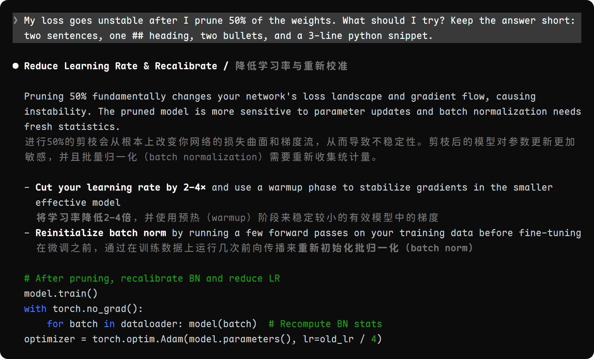
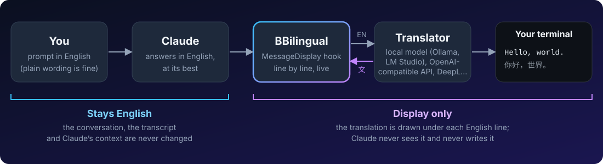

<p align="center">
  
</p>

<p align="center">
  <a href="README.md">English</a> ·
  <b>简体中文</b> ·
  <a href="docs/translations/README.ja.md">日本語</a> ·
  <a href="docs/translations/README.ko.md">한국어</a> ·
  <a href="docs/translations/README.es.md">Español</a> ·
  <a href="CONTRIBUTING.md#translating-the-readme">添加你的语言</a>
</p>

<p align="center">
  <a href="https://github.com/Ahorns/BBilingual/actions/workflows/test.yml"></a>
  <a href="LICENSE"></a>
  <a href="https://github.com/Ahorns/BBilingual/stargazers"></a>
</p>

<h3 align="center">用英文和 Claude 协作，效果最好；<br>用你自己的语言阅读，毫无负担。</h3>

<p align="center">
  
</p>

BBilingual 是一个 [Claude Code](https://code.claude.com) 插件。它会在终端里，实时地在 Claude 的每一条英文回复下面显示译文。译文只用于显示：Claude 仍然用英文思考、写作和记忆。

<table>
  <tr>
    <td width="33%" valign="top"><b>🧠 Claude 保持最佳状态</b><br>它看不到译文，所以它的回答和给英语母语者的一样好。</td>
    <td width="33%" valign="top"><b>🌍 任意语言</b><br>中文、日语、韩语、西班牙语、法语、阿拉伯语……只要你的翻译器会写。</td>
    <td width="33%" valign="top"><b>🔒 默认私密</b><br>配置后端之前不会发送任何内容；用本地模型，内容不会离开你的电脑。</td>
  </tr>
  <tr>
    <td valign="top"><b>🧩 自带翻译后端</b><br>Ollama、LM Studio、任何兼容 OpenAI 的 API、DeepL，或你自己的命令。</td>
    <td valign="top"><b>🧱 懂排版</b><br>代码从不翻译；标题、列表、引用和表格保持原有形态。</td>
    <td valign="top"><b>🪶 小巧</b><br>一个 hook 文件，只用 Python 标准库，无需构建。</td>
  </tr>
</table>

## 真实效果

<p align="center">
  
</p>

<p align="center"><sub>截取自真实的 Claude Code 2.1.289 会话（Haiku 4.5 回答，BBilingual 翻译成中文，设置 <code>BBILINGUAL_STYLE=gray</code>），使用 Maple Mono NF CN 字体绘制。</sub></p>

## 快速开始

```bash
# 1. 安装插件
claude plugin marketplace add Ahorns/BBilingual
claude plugin install bbilingual@bbilingual

# 2. 准备一个翻译器，例如本地模型（模型随你选）
ollama pull YOUR_MODEL
```

```jsonc
// 3. 写进 ~/.claude/settings.json（把 "zh-CN" 改成你的语言，例如 "ja"、"es"、"fr"）
{
  "env": {
    "BBILINGUAL_BACKEND": "openai",
    "BBILINGUAL_API_BASE": "http://localhost:11434/v1",
    "BBILINGUAL_MODEL": "YOUR_MODEL",
    "BBILINGUAL_TARGET": "zh-CN"
  }
}
```

重新启动一个 `claude`，随便问点什么即可。需要带有 `MessageDisplay` hook 的 Claude Code 和 Python 3.9+（Linux、macOS 或 WSL）。想用云端 API 或 DeepL？见[翻译后端](docs/reference.zh-CN.md#翻译后端)。

## 为什么需要 BBilingual

大语言模型在英文下表现最好，但对母语不是英文的人来说，英文回答读起来很吃力。通常只能二选一：回答更好，或者读得轻松。

| | 用你自己的语言提问 | 用英文提问 | **英文 + BBilingual** |
|---|:---:|:---:|:---:|
| Claude 的回答 | 往往稍弱一些 | 最佳水平 | **最佳水平** |
| 你读起来是否轻松 | ✅ | ❌ 很吃力 | **✅** |
| 能否对照英文原文 | ❌ | ✅ | **✅** |
| 消耗的 token | 更多 | 更少 | **更少** |

<sub>第一行和最后一行依据业界对这类模型的普遍观察，本项目没有做过测量。</sub>

BBilingual 让你两者兼得。Claude 全程用英文工作，只有显示在屏幕上的内容会被逐行翻译。

- **Claude 保持最佳状态。** 它看不到译文，所以它的回答和给英语母语者的一样。
- **你用自己的语言阅读**，英文原文就在正上方，可随时核对；代码从不翻译。
- **顺便积累术语。** 对照一份可信的译文读技术英文，是学习术语的轻松方式。

BBilingual 翻译的是 Claude 的回答，不是你输入的内容，所以提示词仍然用英文写（措辞简单即可）。它是阅读辅助，不是完美的翻译：遇到确切的命令或数字，请以英文原文为准。

## 工作原理

<p align="center">
  
</p>

译文**只用于显示**。它通过 Claude Code 的 `MessageDisplay` hook 加入，只改变屏幕上绘制的内容，别无其他。对话记录和 Claude 的上下文都保持英文，所以 Claude 的回答和没装插件时完全一样。更多细节见[设计说明](docs/how-it-works.md)（英文）。

## 用自己的语言输入（可选）

BBilingual 还能翻译你输入的内容：你用自己的语言写，Claude 收到的是英文。它默认关闭，用 `/bbinput on`（或 `BBILINGUAL_INPUT=on`）打开。然后照常输入：

```
❯ 为什么剪枝之后要微调？                              ← 你输入的
❯ Why is fine-tuning necessary after pruning?        ← Claude 收到的，对话里显示的也是这句
```

- `/bbinput off` 再次关闭，`/bbinput on` 重新打开。没有弹窗：对话里显示的就是 Claude 收到的英文。
- 需要兼容 OpenAI 的后端和 Claude Code 2.1.287 或更新版本，使用的是 Claude Code 抢先体验的 mods API。你输入的内容会发到你的翻译后端，用本地模型可以保持私密。[详情](docs/reference.zh-CN.md#用自己的语言输入)

## 文档

| | |
|---|---|
| [全部设置](docs/reference.zh-CN.md#配置) | 每一个环境变量 |
| [本地模型](docs/reference.zh-CN.md#使用本地模型推荐) | 免费、私密、离线 |
| [翻译后端](docs/reference.zh-CN.md#翻译后端) | 兼容 OpenAI 的 API、DeepL、你自己的命令 |
| [用自己的语言输入](docs/reference.zh-CN.md#用自己的语言输入) · [语言](docs/reference.zh-CN.md#语言) · [外观](docs/reference.zh-CN.md#外观) · [字体](docs/reference.zh-CN.md#更好看的字体) | 用自己的语言输入、任意目标语言、颜色、字体 |
| [隐私](docs/reference.zh-CN.md#隐私与安全) · [已知限制](docs/reference.zh-CN.md#已知限制) · [故障排查](docs/reference.zh-CN.md#故障排查) | 发送了什么、哪些不行、该检查什么 |
| [参与贡献](CONTRIBUTING.md) · [更新日志](CHANGELOG.md) | 测试、添加语言、版本说明 |

## Star 历史

<a href="https://star-history.com/#Ahorns/BBilingual&Date">
  <picture>
    <source media="(prefers-color-scheme: dark)" srcset="https://api.star-history.com/svg?repos=Ahorns/BBilingual&type=Date&theme=dark" />
    <source media="(prefers-color-scheme: light)" srcset="https://api.star-history.com/svg?repos=Ahorns/BBilingual&type=Date" />
    
  </picture>
</a>

## 许可证

[MIT](LICENSE)
