<p align="center">
  
</p>

<p align="center">
  <a href="../../README.md">English</a> ·
  <a href="../../README.zh-CN.md">简体中文</a> ·
  <a href="README.ja.md">日本語</a> ·
  <a href="README.ko.md">한국어</a> ·
  <b>Español</b> ·
  <a href="../../CONTRIBUTING.md#translating-the-readme">Añade tu idioma</a>
</p>

<p align="center">
  <a href="https://github.com/Ahorns/BBilingual/actions/workflows/test.yml"></a>
  <a href="../../LICENSE"></a>
  <a href="https://github.com/Ahorns/BBilingual/stargazers"></a>
</p>

<h3 align="center">Trabaja con Claude en inglés para obtener los mejores resultados<br>y lee todo en tu propio idioma.</h3>

<p align="center">
  
</p>

BBilingual es un plugin de [Claude Code](https://code.claude.com). Muestra una traducción debajo de cada línea de las respuestas en inglés, en tu terminal y en tiempo real. La traducción es solo visual: Claude sigue pensando, escribiendo y recordando en inglés.

## Por qué BBilingual

**El problema.** Los grandes modelos de lenguaje funcionan mejor en inglés. Casi todo lo que aprendieron está en inglés, así que preguntar y recibir respuestas en inglés suele ser más preciso, sobre todo en trabajo técnico como programación o ciencia. En otros idiomas las respuestas suelen ser algo más débiles (cuánto depende del modelo y del idioma), y el texto que no es inglés suele gastar más tokens. (Este proyecto no lo ha medido; es el patrón general que se observa en estos modelos.)

Pero leer respuestas en inglés cuesta a quien no domina el idioma. Quien lee despacio, o con un diccionario abierto, se enfrenta a una pantalla de texto técnico denso que cansa y en la que es fácil perder un detalle. Pedirle a Claude que responda en tu idioma resuelve la lectura, pero lo saca del idioma en el que mejor funciona. Así que hay que elegir entre mejores respuestas y respuestas que se leen con comodidad.

| | Pedir en tu idioma | Pedir en inglés | **Inglés + BBilingual** |
|---|:---:|:---:|:---:|
| Respuestas de Claude | a menudo algo peores | en su mejor nivel | **en su mejor nivel** |
| Fácil de leer para ti | ✅ | ❌ cuesta | **✅** |
| El inglés original para comprobar | ❌ | ✅ | **✅** |
| Tokens usados | más | menos | **menos** |

**La idea: no elegir.** Claude trabaja en inglés todo el tiempo. BBilingual traduce solo lo que se dibuja en tu pantalla, línea por línea, a medida que llega.

- **Claude rinde al máximo.** Nunca ve la traducción ni se le pide escribir en dos idiomas, así que sus respuestas son las que daría a un angloparlante.
- **Lees en tu idioma**, a tu ritmo, y el inglés original queda justo encima de cada traducción. Si una traducción te parece rara, las palabras exactas están ahí para comprobarlas. Los bloques de código nunca se traducen.
- **Aprendes vocabulario.** Leer inglés técnico junto a una traducción fiable es una forma suave de aprender los términos que vas a encontrar una y otra vez.

## Inicio rápido

```bash
# 1. instala el plugin
claude plugin marketplace add Ahorns/BBilingual
claude plugin install bbilingual@bbilingual

# 2. consigue un traductor, por ejemplo un modelo local (el que quieras)
ollama pull YOUR_MODEL
```

```jsonc
// 3. en ~/.claude/settings.json ("es" es el idioma de destino; cámbialo por "zh-CN", "ja", "fr", etc.)
{
  "env": {
    "BBILINGUAL_BACKEND": "openai",
    "BBILINGUAL_API_BASE": "http://localhost:11434/v1",
    "BBILINGUAL_MODEL": "YOUR_MODEL",
    "BBILINGUAL_TARGET": "es"
  }
}
```

Abre un `claude` nuevo y pregunta lo que quieras. ¿Prefieres una API en la nube o DeepL? Mira [los backends](../reference.md#backends) (en inglés).

## Conviene saber

- **Se traducen las respuestas de Claude.** Lo que tú escribes no se traduce. Sigue escribiendo tus prompts en inglés (una redacción simple y sencilla basta; Claude la entiende bien).
- **Es una ayuda de lectura, no una traducción perfecta.** Para un comando exacto, una cifra o un matiz, mira el inglés original.
- **Privacidad.** No se envía nada hasta que configuras un backend. Con un modelo local (Ollama, LM Studio) el contenido no sale de tu máquina. El registro está desactivado por defecto.
- **Los mensajes antiguos no se traducen.** Al reabrir una conversación con `claude -c` o `--resume`, las respuestas anteriores se vuelven a dibujar sin traducción.
- **Tipografía.** Para chino, japonés y coreano conviene una fuente monoespaciada que dé a cada carácter el ancho de dos letras latinas (por ejemplo Sarasa Mono). [Más sobre fuentes](../reference.md#fonts-for-a-better-look) (en inglés).

## Documentación completa

Todos los ajustes, los backends, la apariencia y la solución de problemas están en la [referencia en inglés](../reference.md) (también en [简体中文](../reference.zh-CN.md)). Esta página en español está traducida con IA; se agradece la revisión de hablantes nativos.
