<p align="center">
  
</p>

<p align="center">
  <a href="../../README.md">English</a> ·
  <a href="../../README.zh-CN.md">简体中文</a> ·
  <b>日本語</b> ·
  <a href="README.ko.md">한국어</a> ·
  <a href="README.es.md">Español</a> ·
  <a href="../../CONTRIBUTING.md#translating-the-readme">あなたの言語を追加</a>
</p>

<p align="center">
  <a href="https://github.com/Ahorns/BBilingual/actions/workflows/test.yml"></a>
  <a href="../../LICENSE"></a>
  <a href="https://github.com/Ahorns/BBilingual/stargazers"></a>
</p>

<h3 align="center">最良の結果を得るために Claude とは英語でやり取りし、<br>読むのはすべて母語で。</h3>

<p align="center">
  
</p>

BBilingual は [Claude Code](https://code.claude.com) のプラグインです。Claude の英語の返答の各行の下に、翻訳をターミナルへリアルタイムで表示します。翻訳は表示専用で、Claude は引き続き英語で考え、書き、記憶します。

## なぜ BBilingual なのか

**問題。** 大規模言語モデルは英語で最も力を発揮します。学習データの大半が英語なので、英語での質問と回答は、とくにコードや科学などの技術的な作業で、より正確になる傾向があります。ほかの言語では回答がやや弱くなることが多く（程度はモデルと言語によります）、英語以外のテキストはトークン数も多くなりがちです。（この点はこのプロジェクトでは計測しておらず、これらのモデルについて一般に言われている傾向です。）

ところが、英語が得意でない人にとって、英語の回答を読むのは大変です。ゆっくり読んだり、辞書を引きながら読んだりしていると、密度の高い技術的な文章の画面は疲れますし、細部も見落としやすくなります。母語で答えさせれば読むのは楽になりますが、Claude が最も得意な言語から外れてしまいます。結局、「より良い回答」と「楽に読める回答」のどちらかを選ぶことになります。

| | 母語で質問する | 英語で質問する | **英語 + BBilingual** |
|---|:---:|:---:|:---:|
| Claude の回答 | やや弱くなりがち | 最高の状態 | **最高の状態** |
| 読みやすさ | ✅ | ❌ 大変 | **✅** |
| 英語の原文で確認できる | ❌ | ✅ | **✅** |
| 使用トークン | 多い | 少ない | **少ない** |

**考え方：選ばない。** Claude は終始英語で動きます。BBilingual は、画面に描画される内容だけを、届いた行から順に翻訳します。

- **Claude は最高の状態のまま。** 翻訳は Claude には見えず、2 言語で書くよう求められることもないため、英語話者に返すのと同じ回答になります。
- **母語で、自分のペースで読める。** 英語の原文は翻訳のすぐ上にあるので、訳が不自然に見えたらすぐ確認できます。コードブロックは翻訳されません。
- **語彙も身につく。** 信頼できる翻訳を横に置いて技術英語を読むことは、何度も出会う用語を覚える穏やかな方法です。

## クイックスタート

```bash
# 1. プラグインをインストール
claude plugin marketplace add Ahorns/BBilingual
claude plugin install bbilingual@bbilingual

# 2. 翻訳器を用意する。たとえばローカルモデル（好きなモデルで可）
ollama pull YOUR_MODEL
```

```jsonc
// 3. ~/.claude/settings.json に書く（"ja" は翻訳先の言語。"zh-CN"、"es"、"fr" などに変更可）
{
  "env": {
    "BBILINGUAL_BACKEND": "openai",
    "BBILINGUAL_API_BASE": "http://localhost:11434/v1",
    "BBILINGUAL_MODEL": "YOUR_MODEL",
    "BBILINGUAL_TARGET": "ja"
  }
}
```

新しく `claude` を起動して、何でも聞いてみてください。クラウドの API や DeepL を使いたい場合は、[英語版 README の Backends](../../README.md#backends) を参照してください。

## 知っておくこと

- **翻訳されるのは Claude の回答です。** あなたの入力は翻訳されません。プロンプトは英語で書いてください（平易な表現で十分、Claude はよく理解します）。
- **読むための補助であり、完璧な翻訳ではありません。** 正確なコマンド、数値、細かなニュアンスは、英語の原文を確認してください。
- **プライバシー。** バックエンドを設定するまで何も送信されません。ローカルモデル（Ollama、LM Studio）なら内容はマシンの外に出ません。ログは既定でオフです。
- **過去のメッセージは翻訳されません。** `claude -c` や `--resume` で会話を開き直すと、以前の返答は翻訳なしで再描画されます。
- **フォント。** 日本語・中国語・韓国語は 1 文字が半角 2 つ分の幅になる等幅フォント（Sarasa Mono など）を使うと、きれいに見えます。[Fonts](../../README.md#fonts-for-a-better-look)

## すべてのドキュメント

設定項目、すべてのバックエンド、外観の調整、トラブルシューティングは [英語版 README](../../README.md)（[简体中文](../../README.zh-CN.md) もあります）にまとめています。この日本語ページは AI が翻訳したもので、ネイティブの方によるレビューを歓迎します。
