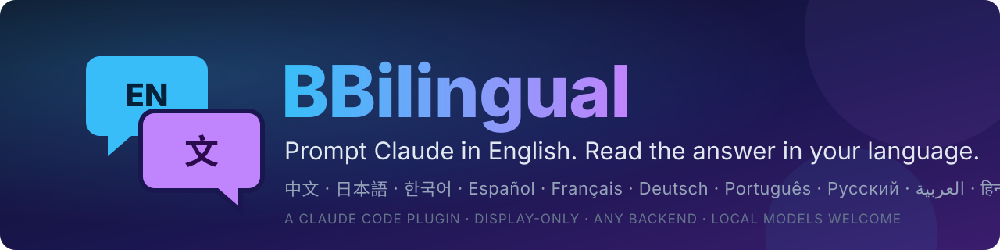

<p align="center">
  
</p>

<p align="center">
  <a href="../../README.md">English</a> ·
  <a href="../../README.zh-CN.md">简体中文</a> ·
  <a href="README.ja.md">日本語</a> ·
  <b>한국어</b> ·
  <a href="README.es.md">Español</a> ·
  <a href="../../CONTRIBUTING.md#translating-the-readme">Add your language</a>
</p>

<p align="center">
  <a href="https://github.com/Ahorns/BBilingual/actions/workflows/test.yml"></a>
  <a href="../../LICENSE"></a>
  <a href="https://github.com/Ahorns/BBilingual/stargazers"></a>
</p>

<h3 align="center">Claude와는 영어로 협업하되,<br>소통은 내 언어로.</h3>

<p align="center">
  
</p>

BBilingual은 [Claude Code](https://code.claude.com) 플러그인입니다. Claude가 영어로 답한 모든 줄 아래에 번역을 터미널에 실시간으로 표시합니다. 번역은 화면 표시 전용입니다. Claude는 계속 영어로 생각하고, 쓰고, 기억합니다.

## 왜 BBilingual인가

**문제.** 대규모 언어 모델은 영어에서 가장 좋은 성능을 냅니다. 학습한 내용 대부분이 영어이기 때문에, 영어로 묻고 영어로 답을 받을 때 특히 코드와 과학 같은 기술 작업에서 더 정확한 경향이 있습니다. 다른 언어에서는 답변이 다소 약해지는 경우가 많고(정도는 모델과 언어에 따라 다릅니다), 영어가 아닌 텍스트는 토큰도 더 많이 사용합니다. (이 프로젝트에서 측정한 것은 아니며, 이런 모델들에 대해 일반적으로 알려진 경향입니다.)

하지만 영어가 편하지 않은 사람에게 영어 답변을 읽는 일은 힘듭니다. 천천히 읽거나 사전을 열어 두고 읽다 보면, 빽빽한 기술 문서 화면은 피곤하고 세부 내용을 놓치기도 쉽습니다. 모국어로 답하게 하면 읽기는 편해지지만, Claude가 가장 잘하는 언어에서 벗어나게 됩니다. 결국 '더 나은 답변'과 '편하게 읽히는 답변' 중 하나를 골라야 합니다.

| | 모국어로 질문 | 영어로 질문 | **영어 + BBilingual** |
|---|:---:|:---:|:---:|
| Claude의 답변 | 다소 약해지기 쉬움 | 최상 | **최상** |
| 읽기 편함 | ✅ | ❌ 힘듦 | **✅** |
| 영어 원문으로 확인 | ❌ | ✅ | **✅** |
| 사용 토큰 | 많음 | 적음 | **적음** |

**발상: 고르지 않는다.** Claude는 처음부터 끝까지 영어로 작업합니다. BBilingual은 화면에 그려지는 내용만, 도착하는 줄부터 차례로 번역합니다.

- **Claude는 최상의 상태를 유지합니다.** 번역은 Claude에게 보이지 않고 두 언어로 쓰라는 요청도 받지 않으므로, 영어 사용자에게 주는 것과 같은 답변을 합니다.
- **모국어로, 자신의 속도로 읽습니다.** 영어 원문이 번역 바로 위에 있어서, 번역이 어색해 보이면 바로 확인할 수 있습니다. 코드 블록은 번역되지 않습니다.
- **어휘도 늘어납니다.** 믿을 만한 번역을 옆에 두고 기술 영어를 읽는 것은, 계속 마주치게 될 용어를 익히는 부드러운 방법입니다.

## 빠른 시작

```bash
# 1. 플러그인 설치
claude plugin marketplace add Ahorns/BBilingual
claude plugin install bbilingual@bbilingual

# 2. 번역기 준비하기. 예를 들어 로컬 모델 (원하는 모델 아무거나)
ollama pull YOUR_MODEL
```

```jsonc
// 3. ~/.claude/settings.json에 작성 ("ko"는 번역할 언어입니다. "zh-CN", "es", "fr" 등으로 바꿀 수 있습니다)
{
  "env": {
    "BBILINGUAL_BACKEND": "openai",
    "BBILINGUAL_API_BASE": "http://localhost:11434/v1",
    "BBILINGUAL_MODEL": "YOUR_MODEL",
    "BBILINGUAL_TARGET": "ko"
  }
}
```

새 `claude`를 시작하고 아무거나 물어보세요. 클라우드 API나 DeepL을 쓰려면 [백엔드 안내](../reference.md#backends)(영어)를 보세요.

## 알아 둘 점

- **번역되는 것은 Claude의 답변입니다.** 직접 입력한 내용은 번역되지 않습니다. 프롬프트는 영어로 쓰세요(쉽고 평범한 표현이면 충분하고, Claude는 잘 이해합니다).
- **읽기를 돕는 도구이며 완벽한 번역은 아닙니다.** 정확한 명령어, 숫자, 미묘한 부분은 영어 원문을 확인하세요.
- **개인정보.** 백엔드를 설정하기 전에는 아무것도 전송되지 않습니다. 로컬 모델(Ollama, LM Studio)을 쓰면 내용이 내 컴퓨터를 벗어나지 않습니다. 로그는 기본적으로 꺼져 있습니다.
- **이전 메시지는 번역되지 않습니다.** `claude -c`나 `--resume`으로 대화를 다시 열면 이전 답변은 번역 없이 다시 그려집니다.
- **글꼴.** 한글·한자·가나는 영문 두 칸 너비를 차지하는 고정폭 글꼴(예: Sarasa Mono)을 쓰면 훨씬 보기 좋습니다. [글꼴 자세히 보기](../reference.md#fonts-for-a-better-look)(영어)

## 전체 문서

모든 설정, 백엔드, 모양 조정, 문제 해결은 [영어 참고 문서](../reference.md)에 있습니다([简体中文](../reference.zh-CN.md)도 있습니다). 이 한국어 페이지는 AI가 번역한 것이며, 원어민의 검토를 환영합니다.
